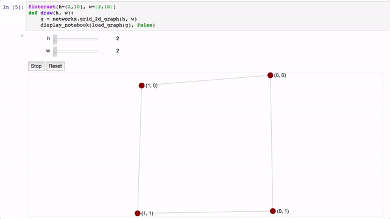

nbgraph
=======

Interactive graph exploration inside of a Jupyter notebook. Graphs are rendered
with [sigma.js](http://sigmajs.org/).

Installation
------------

Install is as simple as:

    pip install nbgraph

Use
---

Graphs are represented with the `NotebookGraph` class. Although manual
graph construction is possible with the `add_node` and `add_edge` methods, the
anticipated use-case is that the user will create or load a graph with another
library and use the `nbgraph` represenation only for the final display of the
graph. With this in mind, `nbgraph` comes with loaders for working with graphs
represented by [igraph](http://igraph.org/) or [networkx](https://networkx.github.io/).

Quick-start Examples
--------------------

See the `examples` directory for the examples as Jupyter notebooks.

## igraph

    from nbgraph.loaders.igraph_loader import load_graph
    import igraph
    G = igraph.Graph.Atlas(381)
    load_graph(G)

## networkx

    from nbgraph.loaders.networkx_loader import load_graph
    import networkx as nx
    G=nx.dodecahedral_graph()
    load_graph(G)

Notebooks with multiple graphs
------------------------------

If you use multiple graphs within the same notebook, you will see a warning
about `nbgraph` being loaded multiple times. This is because the Python code
can't reliably know what's loaded in the JavaScript, so it tries to load it
every time a graph is displayed. This means sending the entire graph rendering
code for each graph, which can explode the size of an `.ipynb` file.

To avoid this, use `prepare_notebook`:

    from nbgraph.renderer import display_notebook, prepare_notebook
    prepare_notebook()

Then, use `display_notebook` with an extra `False` argument to display the
graph:

    my_graph = load_graph(G)
    display_notebook(load_graph(my_graph), False) 